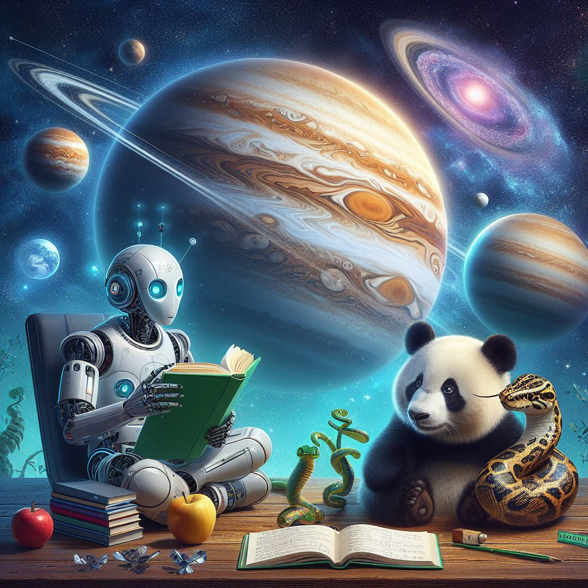

# Hi there :wave:, I'm Thomas

<h3 align="center"> Passionate about data science :test_tube:, machine learning :robot:,  and innovative technologies :bulb: </h3>

<h3 align="left">Languages and Tools:</h3>

